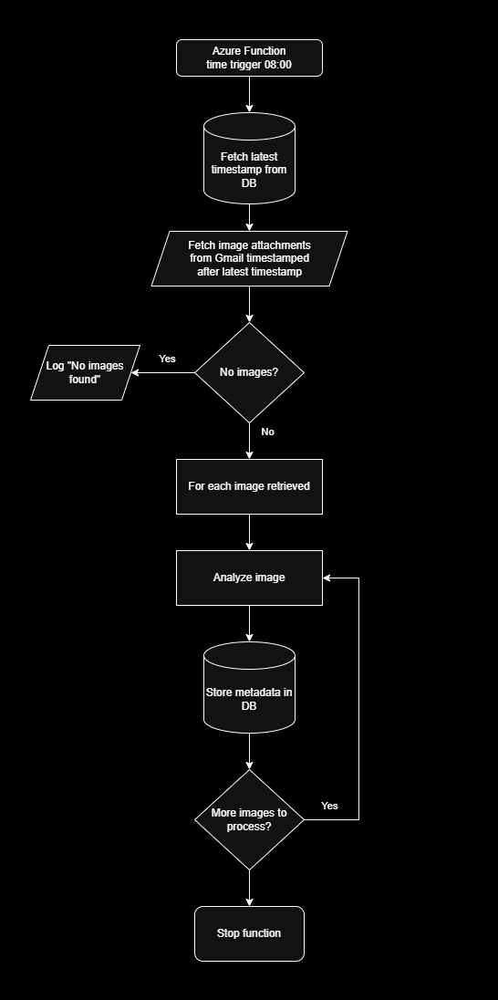

# 🐗 Wild Boar Detection from Wildlife Camera Images (Azure Function Pipeline)
This project is an **Azure Function App** that automates the retrieval, classification, and logging of wildlife camera images sent via email. The core purpose is to identify whether a received image contains a **wild boar** using a custom-trained **ML.NET** classification model and store relevant metadata in a MongoDB database.

> 📌 This project is tailored for personal use and primarily targets images sent from my own wildlife cameras.

---
## 📷 Overview

The function is triggered daily and follows this pipeline:

1. **Retrieve the latest timestamp** from the database.
2. **Fetch image attachments** from a connected Gmail account sent after the latest timestamp.
3. **Loop through all new images** and:
   - Predict whether the image contains a wild boar.
   - Store the image **metadata** and classification result in MongoDB.

The images themselves are **not saved** in the database.

---

## 🔧 Technologies Used

| Technology        | Purpose                                   |
|-------------------|-------------------------------------------|
| `Azure Functions` | Serverless architecture and scheduling    |
| `Google.Apis.Gmail.v1`    `Google.Apis.Auth.OAuth2` | Access Gmail inbox and retrieve attachments |
| `ML.NET`          | Image classification using custom model  |
| `MongoDB.Driver`  | Store prediction metadata in the cloud   |
| `Microsoft.Extensions.Logging` | Logging execution information |
|`Github Actions` | CI/CD pipeline|
---
## ⚠️ Limitations

- The machine learning model only performs **image-level classification** – not object detection or bounding boxes.
- The model is only trained to **classify if the image contains a wild boar** or not.
- It is **only trained on images** captured from **three specific wildlife cameras**, which limits generalizability.
– For cost efficiency purposes, **images are not stored in the database** — only metadata and classification results are saved.

## 📈 Possible Future Improvements

- [ ] Integrate a **web dashboard** for visualizing detections and trends.
- [ ] Replace image classification with **object detection** (e.g., using YOLO or similar model).
- [ ] Add support for **image storage** (e.g., in Azure Blob Storage).
- [ ] Generalize the ML model with **more diverse training data**.

---
## 📄 License
This project is open-source under the MIT License.

## 🙋‍♂️ Author
Created by Johannes Breitfeld – wildlife enthusiast, coder, and machine learning hobbyist.

Feel free to reach out or fork the repo for your own camera trap project!